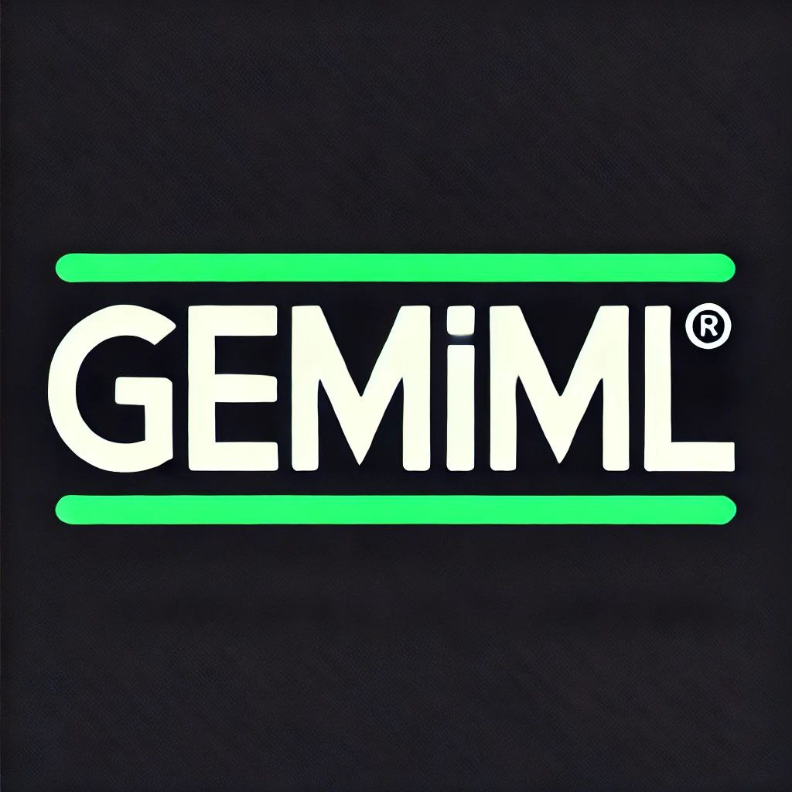

# GeminaL

  

# What is GeminaL?

KasperScan is an open-source tool written in Bash, utilizing the Kaspersky API to scan :
- Hashes
- URLs
- IP Addresses
- Files
- And more...

  

# Clone Geminal Tool

`git clone https://github.com/aker-1/GeminaL.git`   

# Usage
`cd GeminaL`  
`chmod 777 *`  
`./GeminaL.sh`  
 
# Screenshot

  

 

# Requirements

Linux or macOS

Bash Shell

 

# Contributing

Feel free to improve the tool by submitting Pull Requests.

Report issues by opening GitHub Issues.

 

# License

This tool is licensed under the MIT License.

 

# Contact with me

